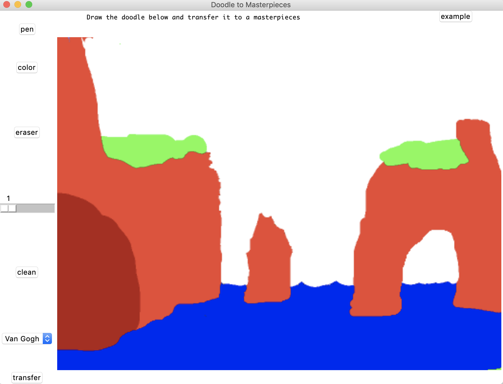

# NN_Project
This is the course project for CSCE636 Neural Network.

Directories:
Models: this folder contains the trained models for Van Gogh, Renoir and Monet. It also contains the graph of these three models.

src: this folder contains the code that is needed while applying models.

Styles: this folder contains three original masterpieces and their doodles. The trained models are trained by them. The user can also use them to train new models.

Train: this folder contains all files that are needed to train a new model. 

### GUI
Simply run
```
python GUI.py
```


### Generate datasets

### Train the model
You also need to download VGG-19 recognition network.
```
cd d && bash download_models.sh && cd ../..
```

### Stylize Doodles

### Prerequisites
- torch
  - [torch7](http://torch.ch/docs/getting-started.html)
- python
  - sklearn
  - skimage
  - numpy
  - scipy
  - h5py
  - joblib
  - tkinter
The code is tested by Python2.7 and the lasted conda.  

  
## Credits
The code is based on [Dmitry Ulyanov's code](https://github.com/DmitryUlyanov/online-neural-doodle).
